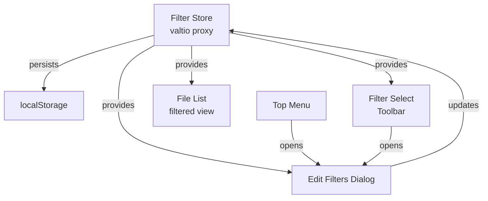

# Add File Filter Feature

## Overview

Add a filter dropdown in the toolbar and a filter management dialog. Filters match file names by pattern and are stored in localStorage. Users can select a filter to show matching files, or "Show all files" to clear filtering. Filters can be managed through an "Edit filters" dialog accessible from both the toolbar dropdown and the top menu.

## Architecture

## Implementation Steps

### 1. Install motion library

- **File**: `package.json`
- Add `motion` library dependency for drag-and-drop reordering

### 2. Create filter store with persistence

- **File**: `src/store/file-filters.ts` (new file)
- Create `FileFilter` interface: `{ id: string, name: string, pattern: string }`
- Create `FileFiltersState` interface with:
  - `filters: FileFilter[]` - list of custom filters
  - `selectedFilterId: string | null` - currently selected filter (null = "Show all files")
- Create valtio member `fileFilters as member of appSettings`   initialized from localStorage
- Add actions in the new file: `addFilter`, `deleteFilter`, `updateFilter`, `reorderFilters`, `selectFilter`

### 3. Add filter atom for dialog state

- **File**: `src/store/ui-atoms.ts`
- Add `dialogEditFiltersOpenAtom = atom(false)` for dialog visibility

### 4. Create filter select component in toolbar

- **File**: `src/components/0-all/2-top-menu-toolbar.tsx`
- Add filter select dropdown using `DropdownMenu` component
- Structure:
  - First item: "Show all files" (clears filter)
  - Middle items: Each filter from `fileFiltersStore.filters`
  - Last item: "Edit filters..." (opens dialog)
- Show current selection state
- Import and use `fileFiltersStore` and `dialogEditFiltersOpenAtom`

### 5. Add filtering logic to FileList

- **File**: `src/components/1-trace-viewer/3-file-list/2-file-list.tsx`
- Import `fileFiltersStore` and `useSnapshot`
- Get `selectedFilterId` from store
- Filter `files` array based on selected filter:
  - If `selectedFilterId === null`: show all files
  - Otherwise: find filter by id and match `file.fileName` against `filter.pattern`
  - Use simple string matching (case-insensitive contains by default, or support wildcards)
- Render filtered files instead of all files

### 6. Create Edit Filters Dialog

- **File**: `src/components/4-dialogs/4-dialog-edit-filters.tsx` (new file)
- Use `Dialog` component (similar to `1-dialog-options.tsx`)
- Display list of filters with:
  - Input field for filter name
  - Input field for pattern
  - Delete button for each filter
  - Drag handle for reordering (using framer-motion)
- Add "Add Filter" button to create new filters
- Use `motion` from framer-motion for drag-and-drop reordering
- Save changes to `fileFiltersStore` on update
- Close button

### 7. Add Edit Filters to top menu

- **File**: `src/components/0-all/2-top-menu.tsx`
- In "View" menu, enable the existing "Filter..." item (currently disabled)
- Set `onClick` to open `dialogEditFiltersOpenAtom`

### 8. Register dialog in App

- **File**: `src/components/0-all/0-app.tsx`
- Import `DialogEditFilters`
- Add to `Dialogs` component

## Filter Pattern Matching

For initial implementation, use simple case-insensitive string matching:

- If pattern contains `*`: treat as wildcard (convert to regex)
- Otherwise: check if `fileName.toLowerCase().includes(pattern.toLowerCase())`

Future enhancement: support regex patterns if needed.

## Files to Create

- `src/store/file-filters.ts` - Filter store and persistence
- `src/components/4-dialogs/4-dialog-edit-filters.tsx` - Edit filters dialog

## Files to Modify

- `package.json` - Add framer-motion dependency
- `src/store/ui-atoms.ts` - Add dialog atom
- `src/components/0-all/2-top-menu-toolbar.tsx` - Add filter select
- `src/components/1-trace-viewer/3-file-list/2-file-list.tsx` - Add filtering logic
- `src/components/0-all/2-top-menu.tsx` - Enable filter menu item
- `src/components/0-all/0-app.tsx` - Register dialog