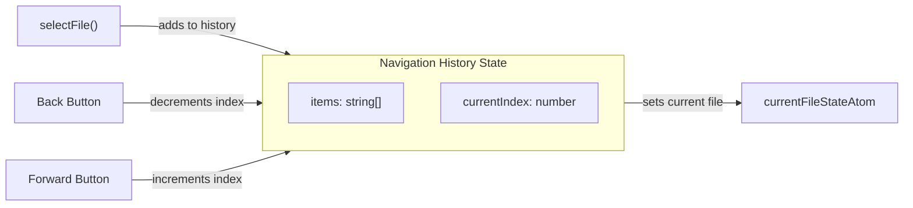

# File Navigation History Implementation

## Architecture Overview

The navigation history will track file selections as a stack with a current position pointer, similar to browser history.



## Files to Modify/Create

### 1. Create History Store: `src/store/traces-store/0-files-history.ts`

New jotai atoms and actions:

- `fileHistoryAtom` - stores `{ items: string[], currentIndex: number }`
- `canGoBackAtom` - derived atom checking if `currentIndex > 0`
- `canGoForwardAtom` - derived atom checking if `currentIndex < items.length - 1`
- `addToHistory(fileId)` - adds file ID, respecting limit
- `goBack()` / `goForward()` - navigation actions
- `removeFromHistory(fileId)` - removes file from history items
- `clearHistory()` - resets history

### 2. Modify Settings: [`src/store/1-ui-settings.ts`](src/store/1-ui-settings.ts)

Add to `AppSettings` interface:

```typescript
historyLimit: number; // Default: 100
```

### 3. Modify File Actions: [`src/store/traces-store/0-files-actions.ts`](src/store/traces-store/0-files-actions.ts)

- In `selectFile()`: call `addToHistory(fileId)` when a file is selected
- In `closeFile()`: call `removeFromHistory(fileId)`
- In `closeOtherFiles()`: remove closed files from history
- In `closeAllFiles()`: call `clearHistory()`

### 4. Add Navigation Buttons: [`src/components/0-all/1-trace-viewer-app.tsx`](src/components/0-all/1-trace-viewer-app.tsx)

Add to `TopMenuToolbar`:

- Back button using `IconChevronLeft` with `rotate-0`
- Forward button using `IconChevronLeft` with `rotate-180`
- Both styled similar to existing toolbar buttons (`ButtonThemeToggle` pattern)
- Disabled state based on `canGoBackAtom`/`canGoForwardAtom`

### 5. Add Settings UI: [`src/components/4-dialogs/1-dialog-options.tsx`](src/components/4-dialogs/1-dialog-options.tsx)

Add input field for history limit under "All times options" or as new section:

```
Navigation options:
[ ] History limit: [100]
```

## Key Implementation Details

- History is a linear array with a position pointer
- When navigating back then selecting a new file, forward history is discarded (browser-like behavior)
- Use a flag to distinguish user selection vs navigation to prevent double-adding during back/forward
- History limit is read from `appSettings.historyLimit` when adding items